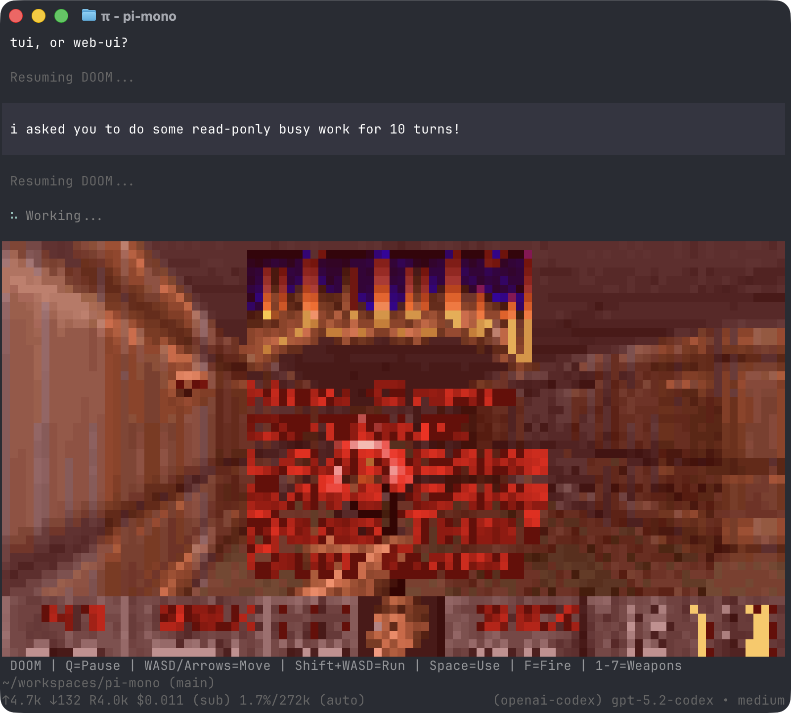

<p align="center">
  <h1>Metis</h1>
</p>
<p align="center">
  <a href="https://discord.com/invite/3cU7Bz4UPx"></a>
  <a href="https://github.com/earendil-works/Metis"></a>
</p>

> New issues and PRs from new contributors are auto-closed by default. Maintainers review auto-closed issues daily. See [CONTRIBUTING.md](../../CONTRIBUTING.md).

---

Metis is a coding agent based on Metis, a minimal terminal coding harness. Adapt Metis to your workflows, not the other way around, without having to fork and modify internals. Extend it with TypeScript [Extensions](#extensions), [Skills](#skills), [Prompt Templates](#prompt-templates), and [Themes](#themes). Put your extensions, skills, prompt templates, and themes in packages and share them with others via npm or git.

Metis ships with Metis's powerful defaults. New Metis-specific features will be added on top.

Metis runs in four modes: interactive, print or JSON, RPC for process integration, and an SDK for embedding in your own apps.

## Share your OSS coding agent sessions

If you use Metis for open source work, please share your coding agent sessions.

Public OSS session data helps improve models, prompts, tools, and evaluations using real development workflows.

For the full explanation, see [this post on X](https://x.com/badlogicgames/status/2037811643774652911).

To publish sessions, use [`badlogic/Metis-share-hf`](https://github.com/badlogic/Metis-share-hf). Read its README.md for setup instructions. All you need is a Hugging Face account, the Hugging Face CLI, and `Metis-share-hf`.

You can also watch [this video](https://x.com/badlogicgames/status/2041151967695634619), where I show how I publish my `Metis-mono` sessions.

I regularly publish my own `Metis-mono` work sessions here:

- [badlogicgames/Metis-mono on Hugging Face](https://huggingface.co/datasets/badlogicgames/Metis-mono)

## Table of Contents

- [Quick Start](#quick-start)
- [Providers & Models](#providers--models)
- [Interactive Mode](#interactive-mode)
  - [Editor](#editor)
  - [Commands](#commands)
  - [Keyboard Shortcuts](#keyboard-shortcuts)
  - [Message Queue](#message-queue)
- [Sessions](#sessions)
  - [Branching](#branching)
  - [Compaction](#compaction)
- [Settings](#settings)
- [Context Files](#context-files)
- [Customization](#customization)
  - [Prompt Templates](#prompt-templates)
  - [Skills](#skills)
  - [Extensions](#extensions)
  - [Themes](#themes)
  - [Metis Packages](#Metis-packages)
- [Programmatic Usage](#programmatic-usage)
- [Philosophy](#philosophy)
- [CLI Reference](#cli-reference)

---

## Quick Start

```bash
npm install -g --ignore-scripts .
```

`--ignore-scripts` disables dependency lifecycle scripts during install.

Authenticate with an API key:

```bash
export ANTHROPIC_API_KEY=sk-ant-...
metis
```

Or use your existing subscription:

```bash
metis
/login  # Then select provider
```

Then talk to Metis. By default, Metis gives the model four tools: `read`, `write`, `edit`, and `bash`. The model uses these to fulfill your requests. Add capabilities via [skills](#skills), [prompt templates](#prompt-templates), [extensions](#extensions), or packages.

**Platform notes:** [Windows](docs/windows.md) | [Termux (Android)](docs/termux.md) | [tmux](docs/tmux.md) | [Terminal setup](docs/terminal-setup.md) | [Shell aliases](docs/shell-aliases.md)

---

## Providers & Models

For each built-in provider, Metis maintains a list of tool-capable models, updated with every release. Authenticate via subscription (`/login`) or API key, then select any model from that provider via `/model` (or Ctrl+L).

**Subscriptions:**
- Anthropic Claude Pro/Max
- OpenAI ChatGPT Plus/Pro (Codex)
- GitHub Copilot

**API keys:**
- Anthropic
- Ant Ling
- OpenAI
- Azure OpenAI
- DeepSeek
- NVIDIA NIM
- Google Gemini
- Google Vertex
- Amazon Bedrock
- Mistral
- Groq
- Cerebras
- Cloudflare AI Gateway
- Cloudflare Workers AI
- xAI
- OpenRouter
- Vercel AI Gateway
- ZAI Coding Plan (Global)
- ZAI Coding Plan (China)
- OpenCode Zen
- OpenCode Go
- Hugging Face
- Fireworks
- Together AI
- Kimi For Coding
- MiniMax
- Xiaomi MiMo
- Xiaomi MiMo Token Plan (China)
- Xiaomi MiMo Token Plan (Amsterdam)
- Xiaomi MiMo Token Plan (Singapore)

See [docs/providers.md](docs/providers.md) for detailed setup instructions.

**Custom providers & models:** Add providers via `~/.metis/agent/models.json` if they speak a supported API (OpenAI, Anthropic, Google). For custom APIs or OAuth, use extensions. See [docs/models.md](docs/models.md) and [docs/custom-provider.md](docs/custom-provider.md).

---

## Interactive Mode

<p align="center"></p>

The interface from top to bottom:

- **Startup header** - Shows shortcuts (`/hotkeys` for all), loaded AGENTS.md files, prompt templates, skills, and extensions
- **Messages** - Your messages, assistant responses, tool calls and results, notifications, errors, and extension UI
- **Editor** - Where you type; border color indicates thinking level
- **Footer** - Working directory, session name, total token/cache usage (`↑` input, `↓` output, `R` cache read, `W` cache write, `CH` latest cache hit rate), cost, context usage, current model

The editor can be temporarily replaced by other UI, like built-in `/settings` or custom UI from extensions (e.g., a Q&A tool that lets the user answer model questions in a structured format). [Extensions](#extensions) can also replace the editor, add widgets above/below it, a status line, custom footer, or overlays.

### Editor

| Feature | How |
|---------|-----|
| File reference | Type `@` to fuzzy-search project files |
| Path completion | Tab to complete paths |
| Multi-line | Shift+Enter (or Ctrl+Enter on Windows Terminal) |
| External editor | Ctrl+G opens `externalEditor`, `$VISUAL`, `$EDITOR`, Notepad on Windows, or `nano` elsewhere |
| Images | Ctrl+V to paste (Alt+V on Windows), or drag onto terminal |
| Bash commands | `!command` runs and sends output to LLM, `!!command` runs without sending |

Standard editing keybindings for delete word, undo, etc. See [docs/keybindings.md](docs/keybindings.md).

### Commands

Type `/` in the editor to trigger commands. [Extensions](#extensions) can register custom commands, [skills](#skills) are available as `/skill:name`, and [prompt templates](#prompt-templates) expand via `/templatename`.

| Command | Description |
|---------|-------------|
| `/login`, `/logout` | OAuth authentication |
| `/model` | Switch models |
| `/scoped-models` | Enable/disable models for Ctrl+P cycling |
| `/settings` | Thinking level, theme, message delivery, transport |
| `/resume` | Pick from previous sessions |
| `/new` | Start a new session |
| `/name <name>` | Set session display name |
| `/session` | Show session info (file, ID, messages, tokens, cost) |
| `/tree` | Jump to any point in the session and continue from there |
| `/trust` | Save project trust decision for future sessions (restart required) |
| `/fork` | Create a new session from a previous user message |
| `/clone` | Duplicate the current active branch into a new session |
| `/compact [prompt]` | Manually compact context, optional custom instructions |
| `/copy` | Copy last assistant message to clipboard |
| `/export [file]` | Export session to HTML or JSONL file |
| `/import <file>` | Import and resume a session from a JSONL file |
| `/share` | Upload as private GitHub gist with shareable HTML link |
| `/reload` | Reload keybindings, extensions, skills, prompts, and context files (themes hot-reload automatically) |
| `/hotkeys` | Show all keyboard shortcuts |
| `/changelog` | Display version history |
| `/quit` | Quit Metis |

### Keyboard Shortcuts

See `/hotkeys` for the full list. Customize via `~/.metis/agent/keybindings.json`. See [docs/keybindings.md](docs/keybindings.md).

**Commonly used:**

| Key | Action |
|-----|--------|
| Ctrl+C | Clear editor |
| Ctrl+C twice | Quit |
| Escape | Cancel/abort |
| Escape twice | Open `/tree` |
| Ctrl+L | Open model selector |
| Ctrl+P / Shift+Ctrl+P | Cycle scoped models forward/backward |
| Shift+Tab | Cycle thinking level |
| Ctrl+O | Collapse/expand tool output |
| Ctrl+T | Collapse/expand thinking blocks |

### Message Queue

Submit messages while the agent is working:

- **Enter** queues a *steering* message, delivered after the current assistant turn finishes executing its tool calls
- **Alt+Enter** queues a *follow-up* message, delivered only after the agent finishes all work
- **Escape** aborts and restores queued messages to editor
- **Alt+Up** retrieves queued messages back to editor

On Windows Terminal, `Alt+Enter` is fullscreen by default. Remap it in [docs/terminal-setup.md](docs/terminal-setup.md) so Metis can receive the follow-up shortcut.

Configure delivery in [settings](docs/settings.md): `steeringMode` and `followUpMode` can be `"one-at-a-time"` (default, waits for response) or `"all"` (delivers all queued at once). `transport` selects provider transport preference (`"sse"`, `"websocket"`, or `"auto"`) for providers that support multiple transports.

---

## Sessions

Sessions are stored as JSONL files with a tree structure. Each entry has an `id` and `parentId`, enabling in-place branching without creating new files. See [docs/session-format.md](docs/session-format.md) for file format.

### Management

Sessions auto-save to `~/.metis/agent/sessions/` organized by working directory.

```bash
metis -c                  # Continue most recent session
metis -r                  # Browse and select from past sessions
metis --no-session        # Ephemeral mode (don't save)
metis --name "my task"    # Set session display name at startup
metis --session <path|id> # Use specific session file or ID
metis --fork <path|id>    # Fork specific session file or ID into a new session
```

Use `/session` in interactive mode to see the current session ID before reusing it with `--session <id>` or `--fork <id>`.

### Branching

**`/tree`** - Navigate the session tree in-place. Select any previous point, continue from there, and switch between branches. All history preserved in a single file.

<p align="center"></p>

- Search by typing, fold/unfold and jump between branches with Ctrl+←/Ctrl+→ or Alt+←/Alt+→, page with ←/→
- Filter modes (Ctrl+O): default → no-tools → user-only → labeled-only → all
- Press Shift+L to label entries as bookmarks and Shift+T to toggle label timestamps

**`/fork`** - Create a new session file from a previous user message on the active branch. Opens a selector, copies the active path up to that point, and places the selected prompt in the editor for modification.

**`/clone`** - Duplicate the current active branch into a new session file at the current position. The new session keeps the full active-path history and opens with an empty editor.

**`--fork <path|id>`** - Fork an existing session file or partial session UUID directly from the CLI. This copies the full source session into a new session file in the current project.

### Compaction

Long sessions can exhaust context windows. Compaction summarizes older messages while keeping recent ones.

**Manual:** `/compact` or `/compact <custom instructions>`

**Automatic:** Enabled by default. Triggers on context overflow (recovers and retries) or when approaching the limit (proactive). Configure via `/settings` or `settings.json`.

Compaction is lossy. The full history remains in the JSONL file; use `/tree` to revisit. Customize compaction behavior via [extensions](#extensions). See [docs/compaction.md](docs/compaction.md) for internals.

---

## Settings

Use `/settings` to modify common options, or edit JSON files directly:

| Location | Scope |
|----------|-------|
| `~/.metis/agent/settings.json` | Global (all projects) |
| `.metis/settings.json` | Project (overrides global) |

See [docs/settings.md](docs/settings.md) for all options.

### Project Trust

On interactive startup, Metis asks before trusting a project folder that contains project-local settings, resources, or project `.agents/skills` and has no saved decision for the folder or a parent folder in `~/.metis/agent/trust.json`. Trusting a project allows Metis to load `.metis/settings.json` and `.Metis` resources, install missing project packages, and execute project extensions.

Before the trust decision, Metis loads only context files, user/global extensions, and CLI `-e` extensions so they can handle the `project_trust` event. Project-local extensions, project package-managed extensions, and project settings are loaded only after the project is trusted. This split also applies when switching to a session from a different cwd whose trust has not been resolved in the current process.

Non-interactive modes (`-p`, `--mode json`, and `--mode rpc`) do not show a trust prompt. Without an applicable saved trust decision, they use `defaultProjectTrust` from global settings: `ask` (default) and `never` ignore those project resources, while `always` trusts them. Pass `--approve`/`-a` or `--no-approve`/`-na` to override project trust for one run.

If no extension or saved decision applies, `defaultProjectTrust` controls the fallback behavior. Set it to `"ask"`, `"always"`, or `"never"` in `~/.metis/agent/settings.json`, or change it with `/settings`.

`metis config` and package commands use the same project trust flow, except `metis update` never prompts. Pass `--approve` to trust project-local settings for one command or `--no-approve` to ignore them.

Use `/trust` in interactive mode to save a project trust decision for future sessions, including trust for the immediate parent folder. It writes `~/.metis/agent/trust.json` only; the current session is not reloaded, so restart Metis for changes to take effect.

### Telemetry and update checks

Metis has two separate startup features:

- **Update check:** fetches `https://metis.dev/api/latest-version` to check whether a newer Metis version exists. Disable it with `METIS_SKIP_VERSION_CHECK=1`. Disabling update checks only turns off this check.
- **Install/update telemetry:** after first install or a changelog-detected update, sends an anonymous version ping to `https://metis.dev/api/report-install`. This setting also controls optional provider attribution headers for OpenRouter, Cloudflare, and direct NVIDIA NIM requests. Opt out by setting `enableInstallTelemetry` to `false` in `settings.json`, or by setting `METIS_TELEMETRY=0`. This does not disable update checks; Metis may still contact `metis.dev` for the latest version unless update checks are disabled or offline mode is enabled.

Use `--offline` or `METIS_OFFLINE=1` to disable all startup network operations described here, including update checks, package update checks, and install/update telemetry.

---

## Context Files

Metis loads `AGENTS.md` (or `CLAUDE.md`) at startup from:
- `~/.metis/agent/AGENTS.md` (global)
- Parent directories (walking up from cwd)
- Current directory

Use for project instructions (`AGENTS.md`/`CLAUDE.md`), conventions, common commands. All matching files are concatenated.

Disable context file loading with `--no-context-files` (or `-nc`).

### System Prompt

Replace the default system prompt with `.metis/SYSTEM.md` (project) or `~/.metis/agent/SYSTEM.md` (global). Append without replacing via `APPEND_SYSTEM.md`.

---

## Customization

### Prompt Templates

Reusable prompts as Markdown files. Type `/name` to expand.

```markdown
<!-- ~/.metis/agent/prompts/review.md -->
Review this code for bugs, security issues, and performance problems.
Focus on: {{focus}}
```

Place in `~/.metis/agent/prompts/`, `.metis/prompts/`, or a [metis package](#Metis-packages) to share with others. See [docs/prompt-templates.md](docs/prompt-templates.md).

### Skills

On-demand capability packages following the [Agent Skills standard](https://agentskills.io). Invoke via `/skill:name` or let the agent load them automatically.

```markdown
<!-- ~/.metis/agent/skills/my-skill/SKILL.md -->
# My Skill
Use this skill when the user asks about X.

## Steps
1. Do this
2. Then that
```

Place in `~/.metis/agent/skills/`, `~/.agents/skills/`, `.metis/skills/`, or `.agents/skills/` (from `cwd` up through parent directories) or a [metis package](#Metis-packages) to share with others. See [docs/skills.md](docs/skills.md).

### Extensions

<p align="center"></p>

TypeScript modules that extend Metis with custom tools, commands, keyboard shortcuts, event handlers, and UI components.

```typescript
export default function (metis: ExtensionAPI) {
  metis.registerTool({ name: "deploy", ... });
  metis.registerCommand("stats", { ... });
  metis.on("tool_call", async (event, ctx) => { ... });
}
```

The default export can also be `async`. Metis waits for async extension factories before startup continues, which is useful for one-time initialization such as fetching remote model lists before calling `metis.registerProvider()`.

**What's possible:**
- Custom tools (or replace built-in tools entirely)
- Sub-agents and plan mode
- Custom compaction and summarization
- Permission gates and path protection
- Custom editors and UI components
- Status lines, headers, footers
- Git checkpointing and auto-commit
- SSH and sandbox execution
- MCP server integration
- Make Metis look like Claude Code
- Games while waiting (yes, Doom runs)
- ...anything you can dream up

Place in `~/.metis/agent/extensions/`, `.metis/extensions/`, or a [metis package](#Metis-packages) to share with others. See [docs/extensions.md](docs/extensions.md) and [examples/extensions/](examples/extensions/).

### Themes

Built-in: `dark`, `light`. Themes hot-reload: modify the active theme file and Metis immediately applies changes.

Place in `~/.metis/agent/themes/`, `.metis/themes/`, or a [metis package](#Metis-packages) to share with others. See [docs/themes.md](docs/themes.md).

### Metis Packages

Bundle and share extensions, skills, prompts, and themes via npm or git. Find packages on [npmjs.com](https://www.npmjs.com/search?q=keywords%3Ametis-package) or [Discord](https://discord.com/channels/1456806362351669492/1457744485428629628).

> **Security:** Metis packages run with full system access. Extensions execute arbitrary code, and skills can instruct the model to perform any action including running executables. Review source code before installing third-party packages.

```bash
metis install npm:@foo/Metis-tools
metis install npm:@foo/Metis-tools@1.2.3      # pinned version
metis install git:github.com/user/repo
metis install git:github.com/user/repo@v1  # tag or commit
metis install git:git@github.com:user/repo
metis install git:git@github.com:user/repo@v1  # tag or commit
metis install https://github.com/user/repo
metis install https://github.com/user/repo@v1      # tag or commit
metis install ssh://git@github.com/user/repo
metis install ssh://git@github.com/user/repo@v1    # tag or commit
metis remove npm:@foo/Metis-tools
metis uninstall npm:@foo/Metis-tools          # alias for remove
metis list
metis update                               # update Metis only
metis update --all                         # update Metis and packages
metis update --extensions                  # update packages only
metis update --self                        # update Metis only
metis update --self --force                # reinstall Metis even if current
metis update npm:@foo/Metis-tools             # update one package
metis config                               # enable/disable extensions, skills, prompts, themes
```

Packages install to `~/.metis/agent/git/` (git) or `~/.metis/agent/npm/` (npm). Use `-l` for project-local installs (`.metis/git/`, `.metis/npm/`). Git `@ref` values are pinned tags or commits; pinned packages are skipped by `metis update --extensions` and `metis update --all`, so use `metis install git:host/user/repo@new-ref` to move an existing package to a new ref. Git packages install dependencies with `npm install --omit=dev` by default, so runtime deps must be listed under `dependencies`; when `npmCommand` is configured, git packages use plain `install` for compatibility with wrappers. If you use a Node version manager and want package installs to reuse a stable npm context, set `npmCommand` in `settings.json`, for example `["mise", "exec", "node@20", "--", "npm"]`.

Create a package by adding a `metis` key to `package.json`:

```json
{
  "name": "my-metis-package",
  "keywords": ["metis-package"],
  "metis": {
    "extensions": ["./extensions"],
    "skills": ["./skills"],
    "prompts": ["./prompts"],
    "themes": ["./themes"]
  }
}
```

Without a `metis` manifest, Metis auto-discovers from conventional directories (`extensions/`, `skills/`, `prompts/`, `themes/`).

See [docs/packages.md](docs/packages.md).

---

## Programmatic Usage

### SDK

```typescript
import { AuthStorage, createAgentSession, ModelRegistry, SessionManager } from "metis";

const authStorage = AuthStorage.create();
const modelRegistry = ModelRegistry.create(authStorage);
const { session } = await createAgentSession({
  sessionManager: SessionManager.inMemory(),
  authStorage,
  modelRegistry,
});

await session.prompt("What files are in the current directory?");
```

For advanced multi-session runtime replacement, use `createAgentSessionRuntime()` and `AgentSessionRuntime`.

See [docs/sdk.md](docs/sdk.md) and [examples/sdk/](examples/sdk/).

### RPC Mode

For non-Node.js integrations, use RPC mode over stdin/stdout:

```bash
metis --mode rpc
```

RPC mode uses strict LF-delimited JSONL framing. Clients must split records on `\n` only. Do not use generic line readers like Node `readline`, which also split on Unicode separators inside JSON payloads.

See [docs/rpc.md](docs/rpc.md) for the protocol.

---

## Philosophy

Metis is aggressively extensible so it doesn't have to dictate your workflow. Features that other tools bake in can be built with [extensions](#extensions), [skills](#skills), or installed from third-party [metis packages](#Metis-packages). This keeps the core minimal while letting you shape Metis to fit how you work.

**No MCP.** Build CLI tools with READMEs (see [Skills](#skills)), or build an extension that adds MCP support. [Why?](https://mariozechner.at/posts/2025-11-02-what-if-you-dont-need-mcp/)

**No sub-agents.** There's many ways to do this. Spawn Metis instances via tmux, or build your own with [extensions](#extensions), or install a package that does it your way.

**No permission popups.** Run in a container, or build your own confirmation flow with [extensions](#extensions) inline with your environment and security requirements.

**No plan mode.** Write plans to files, or build it with [extensions](#extensions), or install a package.

**No built-in to-dos.** They confuse models. Use a TODO.md file, or build your own with [extensions](#extensions).

**No background bash.** Use tmux. Full observability, direct interaction.

Read the [blog post](https://mariozechner.at/posts/2025-11-30-Metis-coding-agent/) for the full rationale.

---

## CLI Reference

```bash
metis [options] [@files...] [messages...]
```

### Package Commands

```bash
metis install <source> [-l]     # Install package, -l for project-local
metis remove <source> [-l]      # Remove package
metis uninstall <source> [-l]   # Alias for remove
metis update [source|self|Metis]   # Update Metis only, or one package source
metis update --all              # Update Metis and packages
metis update --extensions       # Update packages only
metis update --self             # Update Metis only
metis update --self --force     # Reinstall Metis even if current
metis update --extension <src>  # Update one package
metis list                      # List installed packages
metis config                    # Enable/disable package resources
```

`metis config` and project package commands accept `--approve`/`--no-approve` to trust or ignore project-local settings for one command. `metis update` never prompts for project trust.

### Modes

| Flag | Description |
|------|-------------|
| (default) | Interactive mode |
| `-p`, `--print` | Print response and exit |
| `--mode json` | Output all events as JSON lines (see [docs/json.md](docs/json.md)) |
| `--mode rpc` | RPC mode for process integration (see [docs/rpc.md](docs/rpc.md)) |
| `--export <in> [out]` | Export session to HTML |

In print mode, Metis also reads piped stdin and merges it into the initial prompt:

```bash
cat README.md | metis -p "Summarize this text"
```

### Model Options

| Option | Description |
|--------|-------------|
| `--provider <name>` | Provider (anthropic, openai, google, etc.) |
| `--model <pattern>` | Model pattern or ID (supports `provider/id` and optional `:<thinking>`) |
| `--api-key <key>` | API key (overrides env vars) |
| `--thinking <level>` | `off`, `minimal`, `low`, `medium`, `high`, `xhigh` |
| `--models <patterns>` | Comma-separated patterns for Ctrl+P cycling |
| `--list-models [search]` | List available models |

### Session Options

| Option | Description |
|--------|-------------|
| `-c`, `--continue` | Continue most recent session |
| `-r`, `--resume` | Browse and select session |
| `--session <path\|id>` | Use specific session file or partial UUID |
| `--fork <path\|id>` | Fork specific session file or partial UUID into a new session |
| `--session-dir <dir>` | Custom session storage directory |
| `--no-session` | Ephemeral mode (don't save) |
| `--name <name>`, `-n <name>` | Set session display name at startup |

### Tool Options

| Option | Description |
|--------|-------------|
| `--tools <list>`, `-t <list>` | Allowlist specific tool names across built-in, extension, and custom tools |
| `--exclude-tools <list>`, `-xt <list>` | Disable specific tool names across built-in, extension, and custom tools |
| `--no-builtin-tools`, `-nbt` | Disable built-in tools by default but keep extension/custom tools enabled |
| `--no-tools`, `-nt` | Disable all tools by default |

Available built-in tools: `read`, `bash`, `edit`, `write`, `grep`, `find`, `ls`

### Resource Options

| Option | Description |
|--------|-------------|
| `-e`, `--extension <source>` | Load extension from path, npm, or git (repeatable) |
| `--no-extensions` | Disable extension discovery |
| `--skill <path>` | Load skill (repeatable) |
| `--no-skills` | Disable skill discovery |
| `--prompt-template <path>` | Load prompt template (repeatable) |
| `--no-prompt-templates` | Disable prompt template discovery |
| `--theme <path>` | Load theme (repeatable) |
| `--no-themes` | Disable theme discovery |
| `--no-context-files`, `-nc` | Disable AGENTS.md and CLAUDE.md context file discovery |

Combine `--no-*` with explicit flags to load exactly what you need, ignoring settings.json (e.g., `--no-extensions -e ./my-ext.ts`).

### Other Options

| Option | Description |
|--------|-------------|
| `--system-prompt <text>` | Replace default prompt (context files and skills still appended) |
| `--append-system-prompt <text>` | Append to system prompt |
| `--verbose` | Force verbose startup |
| `-a`, `--approve` | Trust project-local files for this run |
| `-na`, `--no-approve` | Ignore project-local files for this run |
| `-h`, `--help` | Show help |
| `-v`, `--version` | Show version |

### File Arguments

Prefix files with `@` to include in the message:

```bash
metis @prompt.md "Answer this"
metis -p @screenshot.png "What's in this image?"
metis @code.ts @test.ts "Review these files"
```

### Examples

```bash
# Interactive with initial prompt
metis "List all .ts files in src/"

# Non-interactive
metis -p "Summarize this codebase"

# Non-interactive with piped stdin
cat README.md | metis -p "Summarize this text"

# Named one-shot session
metis --name "release audit" -p "Audit this repository"

# Different model
metis --provider openai --model gpt-4o "Help me refactor"

# Model with provider prefix (no --provider needed)
metis --model openai/gpt-4o "Help me refactor"

# Model with thinking level shorthand
metis --model sonnet:high "Solve this complex problem"

# Limit model cycling
metis --models "claude-*,gpt-4o"

# Read-only mode
metis --tools read,grep,find,ls -p "Review the code"

# Disable one extension or built-in tool while keeping the rest available
metis --exclude-tools ask_question

# High thinking level
metis --thinking high "Solve this complex problem"
```

### Environment Variables

| Variable | Description |
|----------|-------------|
| `METIS_CODING_AGENT_DIR` | Override config directory (default: `~/.metis/agent`) |
| `METIS_CODING_AGENT_SESSION_DIR` | Override session storage directory (overridden by `--session-dir`) |
| `METIS_PACKAGE_DIR` | Override package directory (useful for Nix/Guix where store paths tokenize poorly) |
| `METIS_OFFLINE` | Disable startup network operations, including update checks, package update checks, and install/update telemetry |
| `METIS_SKIP_VERSION_CHECK` | Skip the Metis version update check at startup. This prevents the `metis.dev` latest-version request |
| `METIS_TELEMETRY` | Override install/update telemetry and provider attribution headers. Use `1`/`true`/`yes` to enable or `0`/`false`/`no` to disable. This does not disable update checks |
| `METIS_CACHE_RETENTION` | Set to `long` for extended prompt cache (Anthropic: 1h, OpenAI: 24h) |
| `VISUAL`, `EDITOR` | Fallback external editor for Ctrl+G when `externalEditor` is unset; defaults to Notepad on Windows and `nano` elsewhere |

---

## Contributing & Development

See [CONTRIBUTING.md](../../CONTRIBUTING.md) for guidelines and [docs/development.md](docs/development.md) for setup, forking, and debugging.

## License

MIT

## See Also

- [metis-ai](https://www.npmjs.com/package/metis-ai): Core LLM toolkit
- [metis-agent-core](https://www.npmjs.com/package/metis-agent-core): Agent framework
- [metis-tui](https://www.npmjs.com/package/metis-tui): Terminal UI components

<p align="center">
  <a href="https://metis.dev">metis.dev</a> domain graciously donated by
  <br /><br />
  <a href="https://exe.dev"><br />exe.dev</a>
</p>
